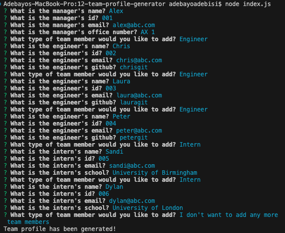
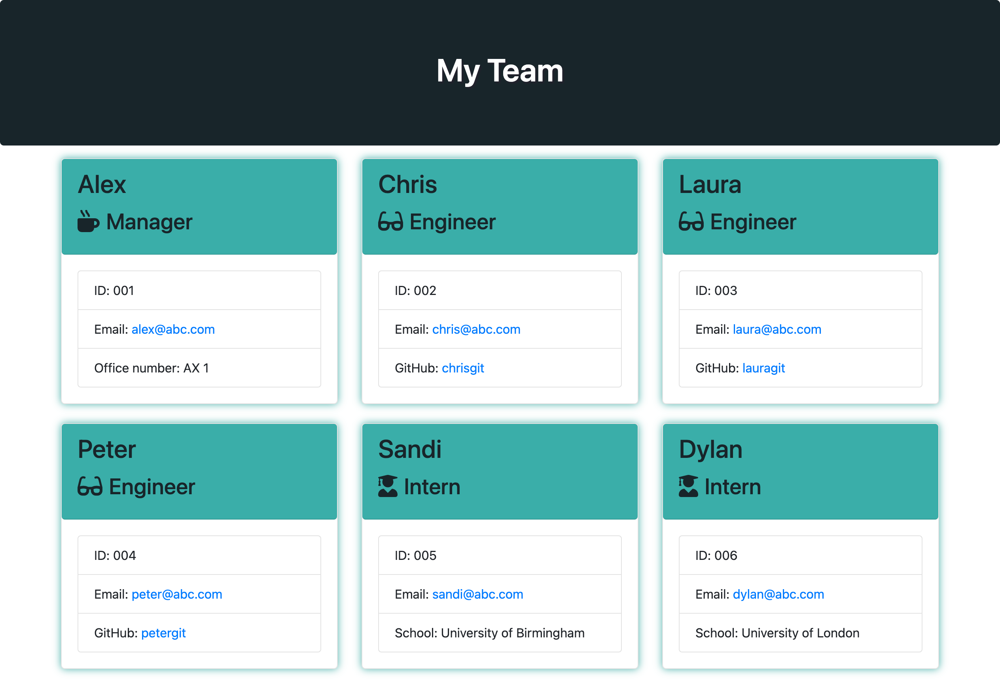
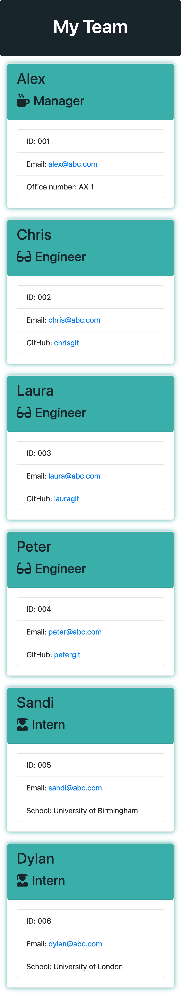
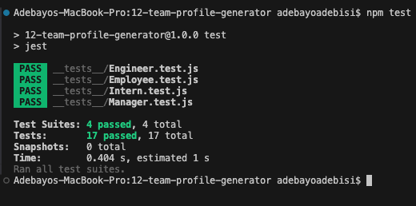

# 12 Team Profile Generator

## Description

The Weather Dashboard is a dynamic web application that allows users to search for and view current and future weather conditions in multiple cities. Utilizing the 5 Day Weather Forecast API from OpenWeatherMap, this dashboard provides travelers with essential weather data to help plan their trips more effectively. The application features dynamically updated HTML and CSS, ensuring a responsive and intuitive user interface.

## Installation

To install the README Generator, follow these steps:

Clone the repository to your local machine using 
```
git clone git@github.com:yourusername/11-professional-README-generator.git
```
Navigate into the project directory and run the below command to install the necessary dependencies.
```
npm install
```

## Usage

After installation, invoke the application with below command from the command line within the project directory. 
```
node index.js
```
Answer the prompted questions about your team. Upon completion, a `index.html` file will be dynamically generated.



## Team Profile Generator Application
The following images shows the Team Profile Generator displaying a working application.



> **Note** This is a screenshot of the deployed Team Profile Generator App.



> **Note** This is a screenshot of the deployed Team Profile Generator Mobile.

## Usage

Application uses Jest for running tests. Invoke using the following command: 
```
npm test
```


> **Note** This is a screenshot of Command line jest test.

## Technologies Used

- JavaScript
- HTML
- CSS
- Bootstrap for styling
- Jest
- npm

## References
[MDN Web Docs on JavaScript:](https://developer.mozilla.org/en-US/docs/Web/JavaScript)

[MDN Web Docs - Using Fetch for API Calls in JavaScript](https://developer.mozilla.org/en-US/docs/Web/API/Fetch_API/Using_Fetch)

[API Documentation | OpenWeatherMap - Documentation](https://openweathermap.org/api)

[MDN Web Docs - Date and Time](https://developer.mozilla.org/en-US/docs/Web/JavaScript/Reference/Global_Objects/Date)

## License
Licensed under [MIT License](LICENSE.md).

## GitHub Repository
URL: https://github.com/adebayoadebisi/08-weather-dashboard-challenge

## Deployed Web Application
URL: https://adebayoadebisi.github.io/08-weather-dashboard-challenge/